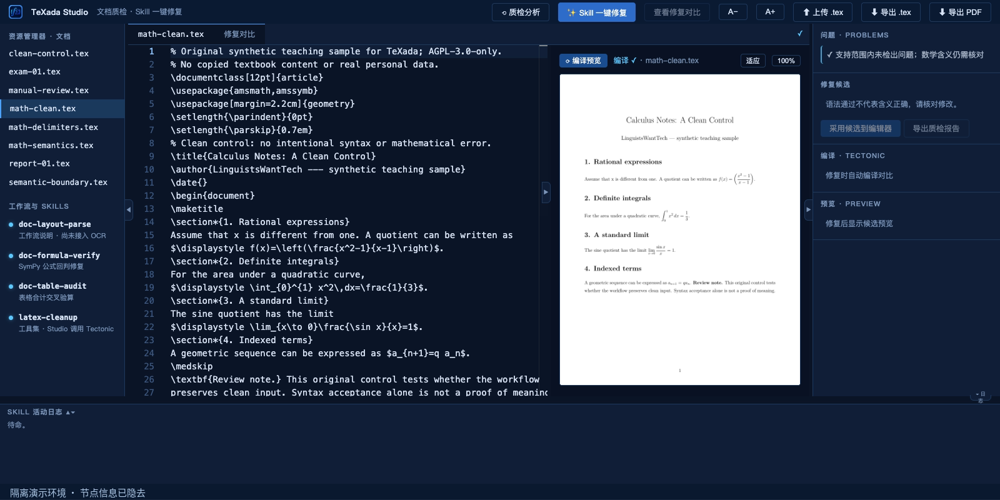

# TeXada Studio with Agent Skills

**Find LaTeX syntax and simple table-total problems, inspect repair candidates, and decide what to adopt.**

[中文](README.md) · [Documentation map (中文)](docs/index.md) · [Demo and evidence](docs/demo.md) · [Casebook (中文)](docs/casebook.md) · [Contributing](CONTRIBUTING.md)

TeXada combines a Monaco editor, deterministic checks, local text-model suggestions, Tectonic previews, and human review. It is intended for teachers, research writers, and developers working with trusted `.tex` documents.

**Experimental prototype; no formal release yet.** The repository is currently private. Access requires authorization. Project-authored source is licensed under [AGPL-3.0-only](LICENSE); third-party components retain their licenses. The open textbook formula pilot and adaptations separately retain [CC-BY-SA-4.0](samples/research/ACTIVE_CALCULUS_NOTICE.md). This is a single-process application for trusted users, not a public multi-user service.



## What it does

- The new LaTeX demo repairs a fraction whose `\left(` has no matching `\right)`. One real model request proposed only the closing delimiter; the candidate passed syntax checking and compilation, then was manually adopted.
- A separate lecture writes the integral of x from 0 to 1 as 1, instead of 1/2. It compiles and passes syntax checks, demonstrating that these checks do not establish mathematical truth.
- Simple table totals remain supported: Studio can deterministically propose `105` when `45 + 60` is incorrectly recorded as `115`.
- Repair candidates open in a diff view. Users explicitly adopt them and can export an audit report.
- The separate CLI reads an existing `layout.json`, records every check and candidate, and writes a report for the current run. It reuses terminal results only when input and execution-context hashes match.

Automatic OCR, image-based repair, general agent planning, complex tables, project uploads, and multi-user isolation are not implemented. CLI real-model mode attempts formula repair only; table repair is currently available through test fixtures, while Studio can recompute simple totals. CLI runs do not invoke Tectonic.

The Studio library now contains **13 documents**, including **8 new original LaTeX teaching samples**: delimiters, fractions, index groups, integral limits, a clean control, a semantic counterexample, and extraction/reference boundaries. See the [sample catalog](samples/README.md) and [12 independent compile checks](docs/evaluation-results/studio-latex/README.md). Author reference repairs are separate from recorded model outputs.

## Try the offline fixture

Python 3.10+ is required; Python 3.13 is the validated environment. These are POSIX-shell commands, tested on macOS; use WSL or translate environment activation on Windows. A fresh dependency installation needs network access. This fixture needs no GPU, model, font installation, or TeX compiler.

```bash
git clone https://github.com/CacinieP/TeXada-Studio-with-agentskills.git
cd TeXada-Studio-with-agentskills
python3 -m venv .venv
. .venv/bin/activate
python -m pip install -r harness/requirements.txt
PYTHONPATH=harness python -m docforensics run samples \
  --state state/quickstart --fixture-repairs samples/fixture_repairs.json
```

Expected: `exam-01 OK=3`, `paper-01 OK=2 NEEDS_HUMAN=1`, `report-01 OK=2`. Open `state/quickstart/report.md`; it identifies the provider as an offline test double. Rerun the same command to exercise resume. Input, model, Skill, checker, or dependency changes invalidate reuse automatically; transient provider/checker failures are retried in the same directory. Use a new directory for an independent run. These counts are workflow checks, not model benchmarks. See the [CLI manual](harness/README.md).

Private clones require repository access and configured GitHub authentication. An authorized source archive is an alternative.

## Run the checker cases

After installing the Python dependencies above, run 27 synthetic formula and table cases:

```bash
python scripts/evaluate_cases.py --outdir state/evaluation-01
```

The [runner](scripts/evaluate_cases.py) writes `report.json` and `report.md` into a new directory and refuses to overwrite existing evidence. Cases cover syntax, Decimal totals, invalid inputs, and unsupported numeric formats. Contract matches, semantic boundaries, and known gaps are reported separately; none is a model-accuracy score. No model, OCR, or network call is made during execution.

See the [case definitions and instructions](samples/evaluation/README.md), [casebook](docs/casebook.md), and [Skills technical report](docs/skills-technical-report.md) for interpretation and limitations. These detailed documents are currently in Chinese.

## Compare Skill instructions

Real-model CLI requests default to `--skill-mode on`; Studio defaults to `SKILL_MODE=on`. An allowlisted host validates and reads the formula Skill, adding its actual instructions to the system message. Off mode keeps the base prompt and the same checking workflow. Fixture mode loads no Skill and makes no model requests. Only the formula Skill is connected to this instruction host; Python still controls tools and retries.

The [research runner](scripts/evaluate_skills.py) compares checker-only, the same model without Skill instructions, and the same model with instructions. It preserves provenance, configuration hashes, every candidate, and a blinded review sheet. Start with a plan-only run:

```bash
python scripts/evaluate_skills.py run \
  --cases samples/research/smoke_cases.json \
  --outdir work/research-dry-01 --mode dry-run
```

Dry-run executes neither checkers nor network requests. See the [research protocol](samples/research/README.md) for fixture, real-model, and human-review commands. Semantic accuracy remains null until independent review; synthetic, injected, and naturally occurring errors must be interpreted separately.

## Run Studio locally

With the virtual environment activated:

```bash
python -m pip install -r webui/requirements.txt
export DEMO_TOKEN="$(python -c 'import secrets; print(secrets.token_urlsafe(32))')"
printf 'http://127.0.0.1:8888/studio?token=%s&file=math-clean.tex\n' "$DEMO_TOKEN"
python -m uvicorn app:app --app-dir webui --host 127.0.0.1 --port 8888
```

The initial `math-clean.tex` lecture uses English text and does not require a CJK font. Switch to `math-delimiters.tex` to try the recorded example; model outputs may differ.

Open the printed private local URL; stop with `Ctrl-C`. Do not share the token. A missing token prevents startup. `.env` is not loaded automatically; after editing a copy of `.env.example`, load it with `set -a; . ./.env; set +a`.

Additional capabilities require:

| Capability | Requirement |
| --- | --- |
| PDF compilation and first-page preview | Tectonic and `pdftoppm` on `PATH`; `TECTONIC` may specify a compiler path |
| Chinese sample compilation | `Noto Sans CJK SC` and required TeX packages |
| Formula repair in Studio | Local Ollama-compatible endpoint fixed at `127.0.0.1:11434`; an installed model selected by `VLM_MODEL` |

Run `ollama list` before selecting a model. The default `qwen3.8:27b-q4_K_M` is the recorded test-node label, not a guaranteed downloadable or preinstalled model. Model calls send text only. First-time Tectonic compilation may download packages. Studio bundles Monaco 0.52.2; the legacy dashboard at `/` still uses a KaTeX CDN.

Use a single Uvicorn worker. Active execution still depends on process memory. Completed results and per-candidate events are stored under `state/studio/jobs/<job_id>/` and can be queried by a known job ID after restart. Interrupted jobs require a new job; model calls do not resume automatically. There is no task-history browser, and unsaved browser edits are not restored. Uploaded files and results live under ignored `state/`; an upload with the same name replaces the previous upload. TeX compilation is not a sandbox. Read [SECURITY.md](SECURITY.md) before sharing an installation.

## Verify and contribute

```bash
python -m pip install -r webui/requirements-test.txt
python -m unittest discover -s webui -p 'test_*.py' -v
python -m unittest discover -s harness/tests -p 'test_*.py' -v
python -m unittest discover -s scripts -p 'test_evaluate_*.py' -v
python -m unittest discover -s skills/latex-cleanup/tests -p 'test_*.py' -v
node webui/test_studio.cjs
node skills/latex-cleanup/tests/test_audit_math.cjs
```

JavaScript checks use Node.js 22. Harness tests cover Skill loading, checker failures, hash-bound resume, and candidate evidence; runner tests cover output protocols, directory protection, and human-review imports. These checks do not require a GPU and do not replace real-browser or TeX compilation checks. There is no automated CI workflow or response-time guarantee.

Start with a synthetic edge-case sample, documentation correction, or a scoped task in the [roadmap](docs/roadmap.md). The [documentation map](docs/index.md) identifies the primary document for each topic and the pages that must change together. Include the exact commit, environment, reproduction steps, and actual verification results. Never attach private documents or credentials.

Maintained by [@CacinieP](https://github.com/CacinieP), team LinguistsWantTech (邓一纯, 刘丰华). See [CITATION.cff](CITATION.cff) for citation metadata and include your actual commit. [Release preparation](docs/open-source-release.md) and [third-party notices](THIRD_PARTY_NOTICES.md) apply before redistribution.
