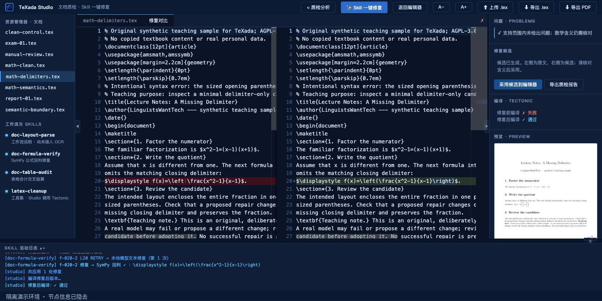
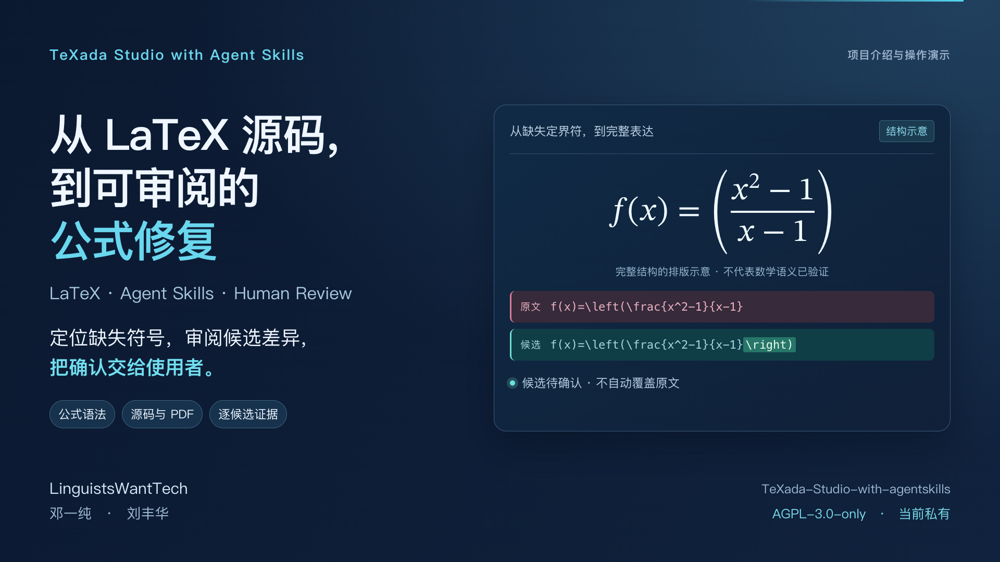

# 演示与可核对结果

## 最新：连续动态实录

已新增约3分42秒的[真实动态录屏](dynamic-demo.md)：同一次浏览器操作完整保留，包含键入撤销、滚动缩放、真实模型等待、差异采用、导出与样本切换。另附同一区间的无配音录屏。新的模型任务耗时70.86秒，和下方分段讲解版本分别记录。

## 前版：LaTeX 分段讲解

以下为此前176.4秒、带等待剪辑和说明图卡的介绍版，不是最新连续实录。

新版从一份数学讲义开始：分式、积分、极限和递推关系与源码并排呈现。随后切换到缺少 `\right)` 的分式，展示真实定位、模型候选、差异审阅、人工采用和导出。最后用错误积分等式说明：能编译、语法通过，也不能证明数学结论正确。

### 前版素材

| 素材 | 内容 | 发布状态 |
| --- | --- | --- |
| 完整演示 `TeXada-Studio-LaTeX案例介绍.mp4` | 约176.4秒（2分56秒）；8个场景，包含真实公式修复、语义反例、Skill、恢复与新增样本库 | 本地交付；尚无公共播放链接 |
| 公式短片 `TeXada-Studio-公式修复短片.mp4` | 约44.1秒；第2、3场景节选，保留候选、人工采用和导出 | 本地交付；尚未上传 |

成片与字幕的[技术验收记录](media/validation.json)随仓库提供。

媒体文件由维护者单独提供，不放入 Git 历史。仓库继续保持私有。文件字节、精确时长和摘要见[媒体清单](media/demo-manifest.json)。旧报表版视频仅作私有历史归档，不随新版默认传播。

前四场景是实际浏览器录屏，后四场景的说明对应已实现机制与样本目录。模型等待已剪去并标明“同一任务实际结果”，结果画面适当停留供阅读；播放时间不能当作推理耗时。旁白为合成语音，字幕为后期说明。节点与资源页脚已遮盖，录制只包含页面内容。

### 前版真实结果

| 文档 | 检查与操作结果 | 服务端任务耗时 |
| --- | --- | --- |
| `math-clean.tex` | 正常对照，0个已检出问题，编译成功 | 未做性能测量 |
| `math-delimiters.tex` | 1次模型请求、1处候选；补上 `\right)`；编译失败→成功；人工采用并导出 PDF、源码与报告 | 67.99秒，包含前后编译和检查 |
| `math-semantics.tex` | 积分错写为1，实际为1/2；0个语法问题且编译成功 | 未做性能测量 |

本次运行时文件与三个录屏输入已核对到提交 `dff5fc6`；样本 SHA256 见[脱敏结果](demo-evidence.json)。[逐候选轨迹](demo-trace.json)保留该模型请求、候选和回判结果。录屏环境只装入当时演示的三个新增文档；第7场景单独展示完整仓库的13份样本清单。单次合成案例成功不能推广为准确率或 Skill 效果结论。

同日早前试卷中的缺失下标两次被拒、整份仍编译失败，保留在[历史失败记录](evaluation-results/studio-earlier/README.md)。12条开放来源先导实验与17次请求属于另一组实验，见[实验解读](skills-pilot-analysis.md)。它们都不是本次录屏重新生成的数据。

### 自己复现

先按 [README](../README.md) 启动 Studio，打开 `math-clean.tex`，再切换到 `math-delimiters.tex`，依次分析、定位、生成候选、查看 diff、人工采用、导出。编译需要 Tectonic 与 Poppler；新增英文数学样本无需中文字体。实际模型可能失败或给出不同答案，应以当前回判和人工审阅为准。

[新增样本清单](../samples/studio-cases.json)把检查预期、作者参考修订和已知边界分开；参考修订不是预先录好的模型回答。[12次独立编译](evaluation-results/studio-latex/README.md)覆盖8份原稿和4份作者参考修订，其中7次产出PDF、5次按预期失败。此编译核验与真实模型演示分别保存。

传播文案和素材用途见[发布与传播计划](launch-plan.md)。
