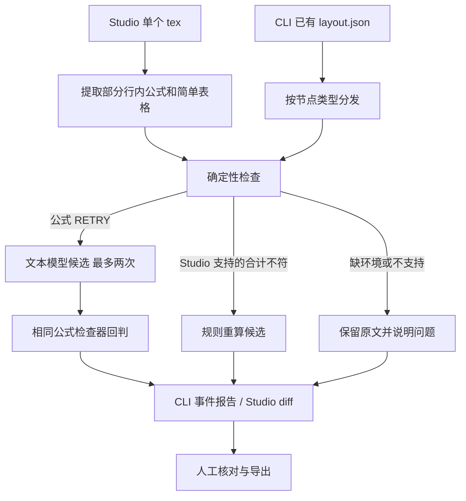

# TeXada Agent Skills 技术报告

作者：LinguistsWantTech；队长邓一纯，队员刘丰华。

版本：2026-09-28 案例与契约补充；实验原型，未正式发布。

阅读入口：[案例手册](casebook.md) · [架构概览](architecture.md) · [实测记录](validation.md) · [文档目录](index.md)

## 1. 研究问题与本轮结论

TeXada 研究怎样把文档检查、模型候选和人工审阅组织成可检查的流程。语法解析、数字合计、TeX 编译和内容含义是四种不同判断，报告必须分别表达。本轮重点是验证失败时系统是否保留原文、停止不合适的修复尝试，并提供可复现的证据。

新增 27 个确定性检查案例、3 份 Studio 场景文件和检查器异常回归。案例同时包含成功、拒绝和检查能力之外的输入；例如 `1+1=3` 通过语法检查，正好说明该检查器不能判定等式真假。本轮没有训练模型、运行 OCR 数据集或完成有无 Skill 的效果对照。

检查发现并修复了非法 JSON/类型/表格索引可能崩溃、无数字合计虚报修改、默认 Decimal 精度舍掉大整数低位，以及候选回判失败后继续请求模型等问题。这些是工程行为改进，不应写成模型智能提升。

## 2. Skill 包与运行时的关系

Agent Skills 规范用 `SKILL.md` 的元数据和正文描述触发条件及操作知识，并允许随包提供脚本和参考资料。这是技能包的组织协议，不自动保证宿主加载、工具执行或任务效果。[规范原文](https://agentskills.io/specification)

本仓库包含六个 Skill。当前 Python 服务**不动态读取 `SKILL.md` 正文**，也不根据它自主选择任意工具；运行时执行预先编排的 Python 分支。Skill 文档供支持此格式的宿主或操作者理解和复用，脚本承担可运行的检查职责。

| Skill | 实际入口 / 调用位置 | 当前提供什么 | 没有提供什么 |
| --- | --- | --- | --- |
| [doc-layout-parse](../skills/doc-layout-parse/SKILL.md) | CLI `pipeline.run()` 读取现有 `layout.json` | 已有结构树的输入准备约定 | PDF/OCR、bbox 推断、阅读顺序推断、裁剪生成 |
| [doc-formula-verify](../skills/doc-formula-verify/SKILL.md) | `verify.py`；CLI `run_verify()`；Studio `_verify_formula()` | SymPy 语法检查，候选回判 | 数学判真、与原图逐符号核对 |
| [doc-table-audit](../skills/doc-table-audit/SKILL.md) | CLI `audit_table.py`；Studio `_table_problems()` | 网格结构及合计；Studio 另有简单 TeX 行解析与重算 | 跨页拼接、合并单元格、复杂数字语义解释 |
| [doc-report](../skills/doc-report/SKILL.md) | CLI `write_report()`；Studio 的报告导出 | 终态、通过候选的差异、待人工事项 | 全部失败候选的可重放轨迹、证据真实性认证 |
| [latex-cleanup](../skills/latex-cleanup/SKILL.md) | 独立 scripts 与测试集 | 清理、编译、带来源摘要的精确补丁等工具 | 当前 Studio/CLI 对整套工具链的自动集成 |
| [spark-ops](../skills/spark-ops/SKILL.md) | 由操作者执行的部署说明 | 用户级环境与节点检查约定 | 自动调度、内存预算管理、并发吞吐保证 |

`evals/evals.json` 是本项目的证据索引，不是官方评测认证。原来的四份设计占位已改为实际案例/测试引用，未实现的版面评测明确标为 `planned`，不再列不存在的样本或虚构数据集规模。

## 3. 两条执行路径



Studio 会在修复任务前后调用 Tectonic，预览 PDF 第一页；CLI 当前不编译 TeX，也不改写 `layout.json` 或原 `.tex`。CLI 的真实提供方 `repair_table()` 返回 `None`，只有 fixture 可以返回预设网格。Studio 表格合计由规则计算，不调用模型。

Studio 的行内公式提取是逐行美元正则，不理解完整 TeX 上下文：注释和 verbatim 中的相似文本也可能被列为候选，应逐处审阅。CLI 的 JSONL 检查器输入防御也不等于完整 `layout.json` schema 校验，结构树仍需按样例准备。

两条路径都使用 Decimal 处理支持范围内的数值，并按输入位数扩展求和精度；它们的输入解析和拒绝条件仍不同，不能称为同一个表格检查器。CLI 允许中英文千分位；Studio 当前接受英文千分位，并严格限制 `tabular` 的行和列格式。

## 4. 输入、状态与退出码

公式脚本接收单个 argv 字符串，或逐行 JSON。调用者必须用参数数组 / stdin 传递原文，禁止将公式拼进 shell 命令。

```json
{"id":"F05","latex":"a_"}
```

| 公式状态 | 含义 | 单记录退出码 | 上游行为 |
| --- | --- | --- | --- |
| `OK` | 可被支持的解析器接受 | 0 | 保留原文，或保留已回判候选供审阅 |
| `RETRY` | 语法失败 / 空公式 | 0 | 可向配置提供方请求候选，最多两次 |
| `NEEDS_HUMAN` | 输入 JSON 或 `latex` 类型不合法 | 1 | 修正输入契约，不请模型补协议 |
| `NEEDS_ENV` | 缺依赖或检查器不可用 | 2 | 先修环境，停止模型尝试 |

JSONL 多记录的退出码取最高严重级别；每条仍有自己的结果。CLI/Studio 包装器检查结构化状态与退出码是否一致，超时、崩溃、坏 JSON、未知状态均不能变成 `OK`。公式子进程超时 30 秒。CLI 把环境问题写成带 `env:` 原因的 `NEEDS_HUMAN` 终态，因此更换环境后需新状态目录重试。

语法检查先处理原始定界符，再去掉 `left/right` 尺寸命令做严格解析，避免只接受残缺输入的前缀。SymPy 将 LaTeX 解析标为实验性功能；它不是通用 TeX 解释器。[SymPy 文档](https://docs.sympy.org/latest/modules/parsing.html#parsing-latex)

表格脚本的一个有效输入如下。索引从 0 起；第一行是表头，首列为标签。

```json
{"id":"T02","rows":[["item","amount"],["A","1.5"],["B","2.5"],["total","4.5"]],"expected":{"n_rows":4,"n_cols":2,"totals":{"col:1":"4.0"}}}
```

表格 `shape_mismatch / sum_mismatch / bad_number` 返回 `RETRY`；非法顶层输入、维度、负索引或越界索引返回 `NEEDS_HUMAN`。脚本不调用模型。表格退出码为正常检查 0、需人工的协议错误 1；包装器对进程异常使用 `NEEDS_HUMAN / checker_error`。

支持有限十进制数、显式正负号和规范千分位。百分比、币种、单位、会计括号和自定义宏不从中抽取第一个数字来计算。Decimal 可以避免常见二进制小数问题，但计算仍受上下文精度约束，因此本轮补了动态精度和 T16/T17 大整数回归。[Python Decimal 文档](https://docs.python.org/3/library/decimal.html)

没有合计行，也没有 `expected.totals` 的 CLI 网格，`OK` 仅表示已执行的结构检查通过；不能宣称已验算所有数字。Studio 只对明确的表头、数据行、唯一末行合计生成候选；标准标签为 `total/合计/总计`。其他布局交给人工，原文保留。

## 5. 模型调用与失败处理

当前 [`OllamaProvider`](../harness/docforensics/vlm.py) 向配置端点的 `/v1/chat/completions` 发送文本，参数为 `temperature=0`、`max_tokens=300`、请求超时 120 秒。输入只包括原始错误公式，没有图片、confidence 或 crop。接口名 `--vlm` 和历史 provider 名 `local-vlm` 不代表实际采用视觉输入。

两次尝试均基于原公式，第二次未加入第一次候选及错误反馈。CLI 遇到空候选就结束；Studio 可以再尝试一次。候选回判出现环境故障时立即停止，Studio 也停止该任务剩余公式的模型请求。服务异常、响应结构错误与模型 JSON 无效当前均折叠为空候选，尚未细分故障类别。

Studio 固定回环端点；CLI 的 `--vlm` 是操作者明确指定的地址，代码并未强制只允许回环地址。部署时应使用获得授权的模型端点。这里的调用是普通 HTTP，不使用 MCP。

Studio 的任务结果目前统一记录配置模型标签与 `local-model-text` provider；纯表格任务也会出现此元数据。判断是否实际调用模型，应结合日志与任务类型，不能以“存在模型字段”作为调用证据。新样本回归通过拦截模型调用验证纯表格、正常对照与人工边界均为零模型请求。

## 6. 差异、证据与续跑

CLI 将事件追加到 `state.jsonl`，新表格修复终态同时保存 `original_rows` 和 `candidate_rows`，报告生成真实 JSON 行差异。旧日志缺少这些字段时明确说明无法还原，不伪造旧候选。已有 crop 可以复制到报告目录，缺失时标注缺失；占位 crop 不证明 OCR 重识别。

CLI 续跑键是 `doc + node_id`，尚未绑定输入哈希、模型或环境。相同标识但内容变更时复用旧状态，会跳过原终态，故必须换新状态目录。未知节点类型是 pass-through `OK`，并不表示经过公式或表格验证。报告基于累计事件，不能直接拿累计计数计算样本准确率。

Studio 保留原文与候选，通过 diff 审阅；“采用”改变浏览器编辑器，**不会自动保存到服务端**，需导出保留。上传才会写入文档目录，同名上传覆盖旧上传。任务状态在进程内存中，重启无法恢复。候选尚有问题时仍可查看和采用，最终判断由使用者承担。

Studio 报告记录内容 SHA256、修改、编译结果、剩余问题和耗时。哈希可以标识内容，不证明内容正确。CLI/Studio 当前主要保存最终通过候选，尚未完整保存每一次被拒绝的候选及其结果；完整可重放事件链属于后续工作。

## 7. 证据分层与结果

| 证据层 | 输入与方法 | 本轮可核对的结论 | 不能推出的结论 |
| --- | --- | --- | --- |
| 检查契约 | F01–F10、T01–T17；27 个合成输入，独立子进程 | 24 个契约例、3 个语义边界例分别核对预期；结果见下方存档 | 模型准确率、真实 OCR 召回率 |
| Studio 场景 | 正常对照、错误等式、三类人工表格、原报表 | 4 项真实检查器测试；零模型调用；该保留的原文保留 | 实际编译、浏览器全流程验收 |
| 管线回归 | mock 故障 + 真实 fixture | 异常不刷模型；真实表格差异；旧日志可读；8 节点续跑跳过 | 模型产生了 fixture 的修复 |
| 实机演示 | 早前 Spark 的两次完整任务 | 报表 115→105；试卷候选与前后编译；见历史记录 | 最新提交性能、冷启动、并发或硬件对照 |

可复核的 [检查结果 JSON](evaluation-results/checker-report.json) 与 [可读报告](evaluation-results/checker-report.md) 保存 Python/依赖版本、案例及检查器 SHA256、每例输入/输出/退出码。摘要匹配代码内容即可复核，不以报告生成时的 Git HEAD 代替实际脚本摘要。

早前实机报表任务 6.94 秒，试卷任务 105.73 秒；它们是已彩排后的单次总耗时，包含前后编译和检查，不是模型延迟或稳定性能基准。录屏核心版本及边界见 [验证记录](validation.md)。本轮案例执行每例启动独立 Python，耗时同样不能当作吞吐基准。

## 8. 最小复现

在仓库根目录和已激活虚拟环境中运行；输出目录必须尚不存在：

```bash
python -m pip install -r harness/requirements.txt
python scripts/evaluate_cases.py --outdir state/evaluation-01
python -m unittest discover -s harness/tests -p 'test_*.py' -v
python -m unittest discover -s scripts -p test_evaluate_cases.py -v
python -m pip install -r webui/requirements-test.txt
python -m unittest discover -s webui -p 'test_*.py' -v
```

CLI fixture 的两次运行及 Studio 操作步骤见 [案例手册](casebook.md)。安装依赖可能联网，案例运行不调用模型或网络。首次编译另需 Tectonic、字体和 TeX 包，不在以上测试声明中。

## 9. 如何继续验证 Skills 的价值

不能只删除本仓库 `SKILL.md`，就声称完成“有无 Skill”对照：当前服务根本不读取该文件。下一轮应先做能够记录 Skill 加载和工具调用的宿主集成，再使用同一模型版本、输入、工具权限、重试预算和编译环境，改变是否向宿主提供 Skill 指令。另设“仅检查器、无模型”和“模型候选 + 检查器”组，区分文字指令与执行约束的贡献。

样本应有再分发授权，按来源分隔开发集与留出集，独立标注错误位置、原意、允许修复和需人工项。先固定评测计划，再由不了解分组的审阅者核对候选。分别报告语法问题检出率、候选语义正确率、正确原文误改率、人工介入比例、调用次数和任务耗时；同时保存失败案例，不用编译通过代替语义评分。

优先级是输入哈希绑定续跑、完整候选事件、模型故障分类和表格统一契约；之后才是有原始图像证据的 OCR、复杂表格和多用户任务持久化。目前没有官方认证、真实数据集准确率或 Skill 带来效果提升的量化结论。
