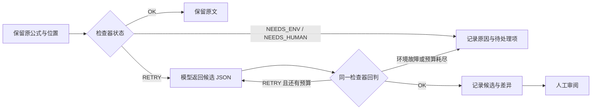

# TeXada Agent Skills 技术报告

作者：LinguistsWantTech；邓一纯、刘丰华。更新：2026-09-29。

[架构](architecture.md) · [案例与命令](casebook.md) · [验证记录](validation.md)

## 问题与设计

TeXada 将 LaTeX 检查、候选生成和人工审阅接成一条可追查的流程。规则能确认简单合计，解析器能判断支持范围内的公式语法，编译器能发现排版错误；公式的数学含义仍需结合原文审阅。系统需要回答三个工程问题：什么时候请求模型，候选如何判定，以及失败后如何继续。

公式 Skill 将这些工作约定放在可单独阅读、修改和比较的任务包中：`SKILL.md` 写触发条件、处理顺序与交付要求，`scripts/` 提供检查器，`evals/` 指向可执行案例。维护者可以沿着一条指令找到对应代码和反例。例如，“检查器环境错误不请求模型”对应 `NEEDS_ENV` 状态；“解析通过仍需审阅”对应 `1+1=3` 也会得到 `OK` 的案例。新宿主接入时，可以复用这个协议，再实现自己的调度与交付方式。

实现采用固定编排。检查器返回结构化状态，Python 决定下一步；模型只为可重试的公式提出候选。每次候选经过同一检查器回判，并与拒绝原因一同保存。Studio 提供 diff 和人工采用，CLI 提供按输入绑定的续跑。Skill 的价值首先体现在工作约定的组织、复用和版本追踪，修复效果另用受控实验检验。

| 层次 | 负责什么 | 具体产物 |
| --- | --- | --- |
| `SKILL.md` | 描述适用任务、步骤、检查含义与审阅要求 | 可加载的指令正文 |
| 检查脚本 | 执行解析或数值规则 | `status`、`reason`、退出码 |
| Python 宿主 | 分发节点、调用脚本和模型、限制尝试、保存结果 | 事件日志、候选及终态 |
| 模型 | 根据公式文本提出最小语法修改 | 严格 JSON 中的 `latex` 字符串 |
| 使用者 | 结合原文核对符号、假设和修改范围 | Studio 中的采用与导出操作，或 CLI 报告的后续审阅 |

这些职责同时写在说明与代码中：说明供模型和维护者理解，宿主实施实际约束。即使 Skill 正文要求“最多两次”，尝试次数仍由循环上限保证；模型返回说明文字时，也由提供方的 JSON 校验决定拒绝。

| 选择 | 原因 | 代价 |
| --- | --- | --- |
| 按任务拆包，公式指令单独加载 | 模型请求只携带当前公式工作需要的约定 | 接入新任务需要补宿主映射 |
| 明确的表格合计由规则计算 | 数字和计算依据可以复算 | 依赖数据行正确及受支持的格式 |
| 检查器异常时停止模型尝试 | 先修复执行环境，避免无效请求 | 环境恢复前保留待处理项 |
| 每个公式最多两次候选 | 调用预算和失败路径清楚 | 当前重试仍用原公式，未反馈上次失败原因 |
| 候选先进入 diff | 使用者能核对修改范围与原意 | 审阅、采用和导出需要人工完成 |

Tectonic 编译结果作为独立诊断展示；界面允许审阅、采用仍有问题的候选。

## Skill 与代码的对应关系

[`skills_runtime.py`](../harness/docforensics/skills_runtime.py)只加载白名单中的 `doc-formula-verify/SKILL.md`，校验 frontmatter 名称、UTF-8 内容、大小及解析后的路径。Skill 与检查脚本的符号链接必须落在技能根目录内。加载器在提供方初始化时读取完整文件，失败即报告配置错误；它不扫描所有包，也不根据自然语言匹配 `description`。CLI 按节点 `type` 分发，Studio 按已抽取的问题类型分发，只有公式的 `RETRY` 进入模型请求。

[`OllamaProvider`](../harness/docforensics/vlm.py)把完整 Skill 文件内容加入 system 消息，原始公式放在独立的 user JSON 中。CLI 默认 `--skill-mode on`，Studio 默认 `SKILL_MODE=on`；`off` 保留基础提示、模型参数、工具和重试预算，只省去 Skill 内容。直接构造提供方的默认值仍为 `off`，产品入口显式传入配置。Fixture 读取预设候选，无模型请求。

日志记录 Skill SHA256、实际请求消息的 `prompt_sha256`、加载标志和请求次数。Skill 指纹回答“用了哪版约定”，请求指纹回答“这次实际发送的指令与公式是否相同”，检查器指纹回答“由哪版规则回判”。Skill、系统提示、请求模板与检查器指纹进入 CLI 的执行上下文，实际请求消息摘要随调用记录；修改指令或检查器后会重新检查，避免复用旧终态。节点选择、检查器执行和重试由 Python 控制；当前没有模型自主选择工具的规划循环。

| Skill | 代码入口或使用方式 | 当前职责 |
| --- | --- | --- |
| [doc-formula-verify](../skills/doc-formula-verify/SKILL.md) | `skills_runtime.py`、`vlm.py`、`verify.py` | 实载公式指令、SymPy 检查、候选回判 |
| [doc-table-audit](../skills/doc-table-audit/SKILL.md) | CLI `audit_table.py`；Studio `_table_problems()` | 结构化网格检查；Studio 另行解析简单 TeX 表格并重算 |
| [doc-report](../skills/doc-report/SKILL.md) | CLI `write_report()`；Studio 导出 | 终态、候选差异、失败原因和调用记录 |
| [doc-layout-parse](../skills/doc-layout-parse/SKILL.md) | CLI 读取现有 `layout.json` | 输入准备约定；自动 PDF/OCR 提取待实现 |
| [latex-cleanup](../skills/latex-cleanup/SKILL.md) | 独立脚本和测试 | LaTeX 整理、编译和验证；Studio 直接调用 Tectonic |
| [spark-ops](../skills/spark-ops/SKILL.md) | 操作者执行部署说明 | 用户级环境配置和节点检查 |

只有公式 Skill 正文接入了上述模型请求宿主。其他包按表中方式使用，包结构遵循 [Agent Skills 规范](https://agentskills.io/specification)。

## 两个入口的处理范围

Studio 从单个 `.tex` 提取同一行内的 `$...$` 和简单 `tabular`，完成检查、候选、前后编译与导出。CLI 从已有 `layout.json` 按节点类型分发检查，保存事件并生成 Markdown 报告，保留输入文件。

两条路径共用公式检查器；表格解析各自实现。CLI 支持结构化 `rows` 和 `expected`，真实提供方的 `repair_table()` 尚未实现，fixture 可提供预设网格。Studio 用规则重算合计，无需模型。

目前的公式提取器使用逐行正则：`align`、`equation`、`\[...\]` 与跨行公式不在范围内，注释或 verbatim 中的美元内容可能被误提取。样本 S12/S13 因此单列“抽取0式”。数学等式真值、复杂表格、图像证据和 OCR 识别留给后续工作，样本与实测据此分别统计。

## 检查器协议与失败处理

公式脚本接收 argv 字符串或 JSONL，例如 `{"id":"F05","latex":"a_"}`。调用端使用参数数组或 stdin 传递公式。

| 状态 | 含义 | 单记录退出码 | 宿主动作 |
| --- | --- | --- | --- |
| `OK` | 支持的语法可解析 | 0 | 保留原文或交付候选供审阅 |
| `RETRY` | 语法失败或空公式 | 0 | 最多两次候选尝试 |
| `NEEDS_HUMAN` | JSON 或 `latex` 类型不合法 | 1 | 保留输入，报告协议问题 |
| `NEEDS_ENV` | 依赖或检查器不可用 | 2 | 停止模型尝试，报告环境问题 |

JSONL 的进程退出码取最高严重级别。CLI/Studio 包装器同时校验输出结构和退出码，子进程限时30秒；崩溃、超时、坏 JSON 或未知状态进入故障路径。CLI 将环境故障保存为带 `env:` 原因的 `NEEDS_HUMAN` 终态，设置 `resumable:false`，恢复后可在同目录重跑。

一条公式在宿主中的处理顺序如下。检查器接受的候选留在报告或 Studio diff 中，人工采用是后续动作。



公式检查先核对原始定界符，再去掉 `\left`、`\right` 尺寸命令并严格解析。这避免了 `x+` 只解析前缀 `x` 的问题，同时保留合法定界符表达式。[SymPy LaTeX 解析](https://docs.sympy.org/latest/modules/parsing.html#parsing-latex)的覆盖范围也会影响结果，例如教材连等式可能触发 `RETRY`。

CLI 表格以0起始索引描述维度和合计。形状、合计或数字格式不符返回 `RETRY`；非法输入、负索引及越界返回 `NEEDS_HUMAN`，包装器故障记为 `checker_error`。支持有限十进制、正负号与规范千分位，按输入位数扩展 Decimal 精度；百分比、币种、单位、会计括号和自定义宏交给人工。CLI 接受中英文千分位，Studio 接受英文千分位并要求明确表头、数据行及唯一末行合计。只有结构约束的 CLI 网格，其 `OK` 表示这些结构约束通过。

## 模型请求与记录

提供方向 `/v1/chat/completions` 发送文本。默认 `temperature=0`、`seed=0`、`max_tokens=300`、超时120秒；先导实验将输出上限统一设为1024。请求包含原始待修公式，候选必须是仅含非空 `latex` 字符串的 JSON。说明文字、Markdown 围栏和多余字段被拒绝。

两次尝试均基于原公式。CLI 遇到空候选即结束，Studio 可以再尝试一次；候选回判遇到环境故障立即停止，Studio 同时停止该任务余下公式的模型请求。错误分类包含 timeout、network_error、http_error、bad_response_json、bad_response_shape 和 bad_candidate_json。原始候选响应最多记录8192字符并标注截断，HTTP 响应上限为1 MiB。

以 [S06 缺失定界符](../samples/docs/math-delimiters.tex)为例，请求的 user 消息只携带任务名与公式；源码行号和问题 ID 留在宿主中关联结果：

```json
{"task":"repair_formula_syntax","latex":"\\displaystyle f(x)=\\left(\\frac{x^2-1}{x-1}"}
```

该次[实机候选](dynamic-demo-trace.json)只补上 `\right)`，随后经过语法回判、前后编译与人工采用。检查器的失败原因虽然写入事件，但当前请求不携带该原因、上一候选、周围段落或 crop 图像。第二次调用因此仍是对原公式的重复尝试；固定种子下可能得到相同候选。加入失败反馈需要调整请求契约，并单独比较候选重复率与误改，不能仅靠修改 Skill 正文获得这些上下文。

`model_calls` 统计发起的 HTTP 尝试，包含超时。Fixture 为0；缺乏 trace 的自定义提供方会标记计数下界。Studio 分别保存 `configured_model` 与实际 `model`，零请求时后者为 null。每个任务创建自己的提供方，防止 trace 串入其他任务。

## 事件与恢复

CLI 在 `state.jsonl` 中依次写入 `CHECK`、`PROVIDER_START`、`PROVIDER_RESULT`、候选接受或拒绝、`TERMINAL` 和 `SKIP`。每次运行有独立 `run_id`，报告只统计本轮；复用项保留来源运行。表格记录 `original_rows` 与 `candidate_rows`，据此生成真实网格差异；旧日志缺字段时显示缺失。

终态匹配键为 `doc + node_id + input_sha256 + context_sha256`。输入摘要覆盖节点内容和已有 crop 字节，执行上下文覆盖程序、检查器、Python/依赖、提供方、模型参数及 Skill。输入或上下文变化会重新检查，暂时故障在恢复后重试。模型标识目前包括标签与配置；同标签更换权重时应新建状态目录并另存 digest。自定义提供方缺少稳定指纹时禁用跨次复用。

日志逐条 flush/fsync，可容忍截断尾行和非对象记录；同目录只允许一个进程写入。未知节点类型走 pass-through，报告中的 `OK` 只表示该节点被保留。完整协议见 [Harness 手册](../harness/README.md)。

Studio 在 `state/studio/jobs/<job_id>/` 保存任务和逐候选事件。编译产物位于 `state/studio/<文档名>/before-<job_id>/` 与 `after-<job_id>/`，按任务隔离。完成结果可在重启后按 ID 读取；中断任务显示已有事件，后续需要新建任务。采用更新浏览器编辑器，导出用于保存；上传则写入文档目录，同名上传会覆盖。当前采用共享令牌、单 worker 和进程内调度。

事件记录检查器接受，使用者采用是另外的界面操作。若进程在请求中途退出，日志可能只留下请求开始；此时保留未完成状态。报告据实际存在的内容生成。

## 怎样扩展和验证 Skill

扩展时先确定一个可检查的任务，再修改对应层次。比如支持多行公式，首要改动是 Studio 的提取器与来源定位；仅扩充公式 Skill 的文字不会让宿主读到 `align` 内容。新增表格模型候选，则需要实现 `repair_table()`、候选结构校验和回判，现有包目录不会自动获得这条调用路径。

1. 在 `SKILL.md` 写清触发条件、输入、状态含义和交付内容；给 `evals/` 增加正常、失败及范围边界案例。
2. 先让脚本的 JSON 与退出码契约通过，再接宿主的分发、尝试上限和事件。新增模型任务还需显式接入加载白名单、请求模板与候选校验。
3. 用 fixture 走通接受、拒绝、空候选和环境故障；修改 Skill、检查器或模型参数后，验证旧终态不再被复用。
4. 固定样本、模型与预算，比较仅检查器、Skill off、Skill on。分别看语法接受、原文误改、人工语义复核和请求用量。

对应验证入口包括[加载器测试](../harness/tests/test_skills_runtime.py)、[实际请求序列化测试](../harness/tests/test_vlm.py)与[三组评测运行器](../scripts/evaluate_skills.py)。前两者核对路径、内容哈希、消息分层和响应校验；运行器核对两模型组的端点、模型、基础提示、检查器和参数一致。Skill on 增加输入 token，比较时需同时报告这部分成本。这样，协议是否执行与指令是否改善结果可以分别检验。

## 可执行复现

从仓库根目录、已激活的 Python 3.11+ 虚拟环境运行。输出目录应为新目录；只有续跑检查复用同一目录。

```bash
python -m pip install -r harness/requirements.txt
python scripts/evaluate_cases.py --outdir state/skills-checks-01
PYTHONPATH=harness python -m docforensics run samples \
  --state state/skills-cli-01 --fixture-repairs samples/fixture_repairs.json
```

检查器报告应为27例符合预期。CLI 首次得到7个 `OK`、1个 `NEEDS_HUMAN`；重复相同 CLI 命令得到8个 `SKIP`。查看 `report.md` 与 `state.jsonl`，核对预设候选、表格差异、请求数和复用来源。

先用预设候选验证三组评测与报告流程：

```bash
python scripts/evaluate_skills.py run \
  --cases samples/research/smoke_cases.json \
  --outdir work/skills-fixture-01 --mode fixture \
  --fixture-repairs samples/research/smoke_repairs.json
```

它执行真实检查器，模型请求数为0。使用实际模型时，按[研究协议](../samples/research/README.md)显式指定 `--mode model`、端点和模型标签；先导实验的命令与复核入口见[实验分析](skills-pilot-analysis.md)。Studio 样本、故障注入及编译复现见[案例手册](casebook.md)。

## 结果与下一步

27个合成检查案例均符合预期，覆盖非法输入、严格解析、数字格式与精度。三处缺陷直接对应实现改动：F04 的 `x+` 促成完整解析；S05 的横杠合计要求确认源码实际改变；T16/T17 的大整数促成动态精度设置。[检查报告](evaluation-results/checker-report.md)保留逐例响应和退出码。

Studio 共13份文档，新增8份包含4类语法缺陷、正常对照、积分语义反例和两类范围边界；它们共抽取15个公式、报告4个语法问题。8份原稿与4份作者参考修订的独立编译结果全部符合预期。最新实机运行在 S06 上完成1次请求、1处修复、编译失败转通过及人工采用导出；缺失下标候选仍失败的旧记录另行保留。[编译复现](evaluation-results/studio-latex/README.md) · [实机记录](dynamic-demo.md) · [历史失败](evaluation-results/studio-earlier/README.md)

三组先导实验使用6条开放教材公式及6条人工注入变体。两个模型组各有5个候选被语法接受，最终输出相同；17次 HTTP 尝试中有1次超时。独立人工语义复核待完成。当前结果支持运行与证据流程的复核，尚未观察到 Skill 的输出增益；小规模单来源实验也不足以估计真实文档效果。详见[实验分析](skills-pilot-analysis.md)。

下一步优先改进 TeX 上下文提取，完成独立语义复核，再扩大自然错误与正常对照来源。第二次尝试加入失败反馈也值得单独对照，保持相同预算，观察候选重复率和误改。完整测试数量、环境及历史版本集中记录在[验证页](validation.md)。
