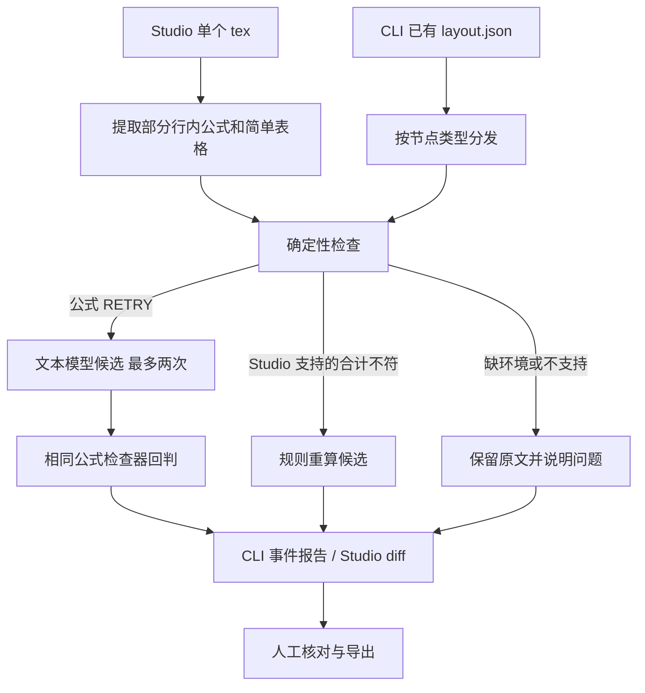

# TeXada Agent Skills 技术报告

作者：LinguistsWantTech；队长邓一纯，队员刘丰华。

版本：2026-09-29 LaTeX 场景与独立编译补充；保留此前 Skill 宿主、证据留存与受控评测记录。实验原型，未正式发布。

阅读入口：[案例手册](casebook.md) · [架构概览](architecture.md) · [实测记录](validation.md) · [文档目录](index.md)

## 1. 研究问题与工程贡献

TeXada 研究怎样把文档检查、模型候选和人工审阅组织成可检查的流程。语法解析、数字合计、TeX 编译和内容含义是四种不同判断，报告必须分别表达。本报告关注：系统能否在检查失败时保留原文、限制不适当的模型调用，并让使用者核对候选的依据。

早前补充建立27个确定性检查案例、3份新 Studio 场景及异常回归，将 Studio 文档扩至5份；随后加入实际读取 Skill 的宿主、逐候选事件、输入绑定续跑和三组公式先导实验。本轮再加入8份原创 LaTeX 教学样本，Studio 总数为13，增加抽取与候选处理契约，并单独记录12次编译。新增样本不改变原检查器或先导实验的分母。语义反例能通过解析甚至生成PDF，说明两种工具都不能判定等式真假；先导实验的独立人工语义复核仍未完成，不能宣称 Skill 提升了修复正确率。

检查发现并修复了非法 JSON/类型/表格索引可能崩溃、无数字合计虚报修改、默认 Decimal 精度舍掉大整数低位，以及候选回判失败后继续请求模型等问题。这些是工程行为改进，不应写成模型智能提升。

### 可核对的三项贡献

| 工程贡献 | 实现选择 | 现有证据 |
| --- | --- | --- |
| 用输入与状态契约约束候选生成 | 区分语法失败、非法输入和环境故障；仅允许合适的失败进入有限重试 | 公式退出码协议，F09/F10，包装器超时、坏回包和停止调用回归 |
| 将候选、采用与证据分开 | 保存原检查、每次请求、候选及拒绝原因；按内容和上下文绑定续跑；编译结果单独报告 | 续跑与报告回归、持久任务测试、逐项 JSONL |
| 分离契约验证与效果评测 | 27例合成回归描述边界；12条开放来源先导样本分别运行三组，语义结果等待人工复核 | 检查器报告、受控运行清单、带哈希的盲审 CSV |

这些贡献是工作流与验证方法，可以依据源码和输出复核；没有提出新的模型算法，也没有以合成回归集证明对未知文档的效果增益。

### 设计取舍

| 选择 | 为什么采用 | 对覆盖范围或使用成本的影响 |
| --- | --- | --- |
| 对明确合计使用规则计算 | 输入与计算依据清楚，可以复算，不需要模型推测数字 | 假设数据行正确；无法判断源数据是否误识别 |
| 对检查器异常停止模型尝试 | 环境故障不应变成文档内容修改 | 环境修复前不能继续自动处理该类问题 |
| 完整数值格式匹配，不从复杂单元格猜取数字 | 避免把百分比、单位或括号负数当普通正数 | 更多复杂表格需要人工处理 |
| 固定编排、最多两次候选尝试 | 分支与调用预算明确，便于定位失败 | 当前没有动态Skill规划；相同输入重试也不保证候选改善 |
| 候选先供审阅 | 使用者能看到每处改动并核对原意 | 审阅和导出仍需要人工操作 |

Tectonic编译是独立诊断，不是采用候选的硬性门槛。当前界面允许查看或采用仍有问题的候选；设计能提供审阅依据，尚不能保证使用者一定作出正确决定。

## 2. Skill 包与运行时的关系

Agent Skills 规范用 `SKILL.md` 的元数据和正文描述触发条件及操作知识，并允许随包提供脚本和参考资料。这是技能包的组织协议，不自动保证宿主加载、工具执行或任务效果。[规范原文](https://agentskills.io/specification)

本仓库包含六个 Skill。现在公式模型提供方通过白名单读取 `doc-formula-verify/SKILL.md`，校验名称、路径和符号链接边界，并将完整正文放入 system 消息。用户公式单独放入 user JSON，作为不可信文档数据。CLI 的 `--skill-mode on` 与 Studio 的 `SKILL_MODE=on` 默认开启；`off` 保留相同基础提示、模型和调用参数，仅省去 Skill 正文。

加载行为由 `skills_runtime.py` 与 `OllamaProvider` 实现，Python 仍负责固定分支、重试预算和检查器执行；模型没有工具调用权限，也不自主规划。其余 Skill 未因此自动注入模型。内置提供方默认构造参数为 off，以兼容直接调用者；产品入口显式传入 on。记录包含 Skill 文件 SHA256、实际请求提示摘要、加载标志和请求尝试次数，能够区分配置开启、实际发送和规则任务未请求模型。

| Skill | 实际入口 / 调用位置 | 当前提供什么 | 没有提供什么 |
| --- | --- | --- | --- |
| [doc-layout-parse](../skills/doc-layout-parse/SKILL.md) | CLI `pipeline.run()` 读取现有 `layout.json` | 已有结构树的输入准备约定 | PDF/OCR、bbox 推断、阅读顺序推断、裁剪生成 |
| [doc-formula-verify](../skills/doc-formula-verify/SKILL.md) | `skills_runtime.py`、`OllamaProvider`；`verify.py` | 公式 Skill 实载、SymPy 语法检查与候选回判 | 数学判真、模型自主工具调用、与原图逐符号核对 |
| [doc-table-audit](../skills/doc-table-audit/SKILL.md) | CLI `audit_table.py`；Studio `_table_problems()` | 网格结构及合计；Studio 另有简单 TeX 行解析与重算 | 跨页拼接、合并单元格、复杂数字语义解释 |
| [doc-report](../skills/doc-report/SKILL.md) | CLI `write_report()`；Studio 的报告导出 | 当次终态、原检查、接受/拒绝候选、请求计数与复用依据 | 从日志重新执行模型、证据真实性认证 |
| [latex-cleanup](../skills/latex-cleanup/SKILL.md) | 独立 scripts 与测试集 | 清理、编译、带来源摘要的精确补丁等工具 | 当前 Studio/CLI 对整套工具链的自动集成 |
| [spark-ops](../skills/spark-ops/SKILL.md) | 由操作者执行的部署说明 | 用户级环境与节点检查约定 | 自动调度、内存预算管理、并发吞吐保证 |

`evals/evals.json` 是本项目的证据索引，不是官方评测认证。原来的四份设计占位已改为实际案例/测试引用，未实现的版面评测明确标为 `planned`，不再列不存在的样本或虚构数据集规模。

## 3. 两条执行路径



Studio 会在修复任务前后调用 Tectonic，预览 PDF 第一页；CLI 当前不编译 TeX，也不改写 `layout.json` 或原 `.tex`。CLI 的真实提供方 `repair_table()` 返回 `None`，只有 fixture 可以返回预设网格。Studio 表格合计由规则计算，不调用模型。

Studio 只提取同一行的 `$...$`，不理解完整 TeX 上下文：注释和 verbatim 中的相似文本可能被误列为候选，`align*`、`equation`、`\[...\]` 与跨行公式又不会因此被检查。新样本 S12/S13 明确记录0抽取，不能把0问题解释为全篇检查通过。CLI 校验布局顶层、节点列表、节点对象与重复 ID，但没有实现完整 OCR 布局 schema，结构树仍需按样例准备。

两条路径都使用 Decimal 处理支持范围内的数值，并按输入位数扩展求和精度；它们的输入解析和拒绝条件仍不同，不能称为同一个表格检查器。CLI 允许中英文千分位；Studio 当前接受英文千分位，并严格限制 `tabular` 的行和列格式。

## 4. 输入、状态与退出码

公式脚本接收单个 argv 字符串，或逐行 JSON。调用者必须用参数数组 / stdin 传递原文，禁止将公式拼进 shell 命令。

```json
{"id":"F05","latex":"a_"}
```

| 公式状态 | 含义 | 单记录退出码 | 上游行为 |
| --- | --- | --- | --- |
| `OK` | 可被支持的解析器接受 | 0 | 保留原文，或保留已回判候选供审阅 |
| `RETRY` | 语法失败 / 空公式 | 0 | 可向配置提供方请求候选，最多两次 |
| `NEEDS_HUMAN` | 输入 JSON 或 `latex` 类型不合法 | 1 | 修正输入契约，不请模型补协议 |
| `NEEDS_ENV` | 缺依赖或检查器不可用 | 2 | 先修环境，停止模型尝试 |

JSONL 多记录的退出码取最高严重级别；每条仍有自己的结果。CLI/Studio 包装器检查结构化状态与退出码是否一致，超时、崩溃、坏 JSON、未知状态均不能变成 `OK`。公式子进程超时 30 秒。CLI 把环境问题写成带 `env:` 原因的 `NEEDS_HUMAN` 终态并设 `resumable:false`，同一状态目录重跑会重新处理；依赖版本改变也会使执行上下文摘要失效。

语法检查先处理原始定界符，再去掉 `left/right` 尺寸命令做严格解析，避免只接受残缺输入的前缀。SymPy 将 LaTeX 解析标为实验性功能；它不是通用 TeX 解释器。[SymPy 文档](https://docs.sympy.org/latest/modules/parsing.html#parsing-latex)

表格脚本的一个有效输入如下。索引从 0 起；第一行是表头，首列为标签。

```json
{"id":"T02","rows":[["item","amount"],["A","1.5"],["B","2.5"],["total","4.5"]],"expected":{"n_rows":4,"n_cols":2,"totals":{"col:1":"4.0"}}}
```

表格 `shape_mismatch / sum_mismatch / bad_number` 返回 `RETRY`；非法顶层输入、维度、负索引或越界索引返回 `NEEDS_HUMAN`。脚本不调用模型。表格退出码为正常检查 0、需人工的协议错误 1；包装器对进程异常使用 `NEEDS_HUMAN / checker_error`。

支持有限十进制数、显式正负号和规范千分位。百分比、币种、单位、会计括号和自定义宏不从中抽取第一个数字来计算。Decimal 可以避免常见二进制小数问题，但计算仍受上下文精度约束，此前已补充动态精度和 T16/T17 大整数回归。[Python Decimal 文档](https://docs.python.org/3/library/decimal.html)

没有合计行，也没有 `expected.totals` 的 CLI 网格，`OK` 仅表示已执行的结构检查通过；不能宣称已验算所有数字。Studio 只对明确的表头、数据行、唯一末行合计生成候选；标准标签为 `total/合计/总计`。其他布局交给人工，原文保留。

## 5. 模型调用与失败处理

当前 [`OllamaProvider`](../harness/docforensics/vlm.py) 向配置端点的 `/v1/chat/completions` 发送文本，默认参数为 `temperature=0`、`seed=0`、`max_tokens=300`、请求超时 120 秒。CLI 与评测入口允许显式设置种子和输出预算；本次先导实验统一使用 1024 tokens。输入只包括原始错误公式，没有图片、confidence 或 crop。接口名 `--vlm` 和历史 provider 名 `local-vlm` 不代表实际采用视觉输入。

两次尝试均基于原公式，第二次未加入第一次候选及错误反馈。CLI 遇到空候选就结束；Studio 可以再尝试一次。候选回判出现环境故障时立即停止，Studio 也停止该任务剩余公式的模型请求。提供方区分 timeout、network_error、http_error、bad_response_json、bad_response_shape、bad_candidate_json 等故障。候选必须是只有非空 latex 字段的 JSON；说明文字、Markdown 围栏和多余字段会被拒绝。返回 None 仍兼容旧调用接口，但 trace 保留明确原因与最多8192字符的原始候选响应，截断时有标志。整个 HTTP 响应超过1MiB拒绝，候选文本另有长度上限。

Studio 固定回环端点；CLI 的 `--vlm` 是操作者明确指定的地址，代码并未强制只允许回环地址。部署时应使用获得授权的模型端点。这里的调用是普通 HTTP，不使用 MCP。

Studio 分别记录 configured_model 和实际 model；零请求时 model 为 null，provider 为 deterministic-checks。每个任务独立创建提供方，避免并发任务覆盖 last_trace。`model_calls` 统计已发起的 HTTP 请求尝试，超时也计1，不代表服务端完成推理。fixture 调用始终为0模型请求；CLI 对没有 trace 的自定义提供方报告计数未知下界。

## 6. 差异、证据与续跑

CLI 将事件追加到 `state.jsonl`，新表格修复终态同时保存 `original_rows` 和 `candidate_rows`，报告生成真实 JSON 行差异。旧日志缺少这些字段时明确说明无法还原，不伪造旧候选。已有 crop 可以复制到报告目录，缺失时标注缺失；占位 crop 不证明 OCR 重识别。

CLI 以 `doc + node_id + input_sha256 + context_sha256` 匹配可复用终态。输入摘要包含规范化节点与已有 crop 字节摘要；执行上下文覆盖检查器、管线、状态实现、Python/依赖、提供方、模型参数及 Skill。同 ID 内容变化、更换模型/Skill/检查器后会重新处理；旧日志没有摘要也不会跳过。当前模型身份包含标签和配置，不主动查询权重摘要；同标签被替换权重或服务实现升级时应新建状态目录，并另存模型 digest/服务版本。未知自定义提供方不能提供稳定 fingerprint 时禁用跨次复用。

暂时性提供方故障和环境故障不复用，服务恢复后可原目录重跑。两次语法修复失败、明确人工边界仍可复用，独立实验应使用新目录。每次 CLI 执行都有 run_id；报告只统计当次 TERMINAL/SKIP，复用节点显示原候选与来源运行，不把历史模型调用计入当次。未知节点类型仍为 pass-through OK，不表示经过公式或表格验证。状态文件逐条 flush/fsync，容忍半行和非对象 JSON；没有跨进程写锁，不允许共享同一状态目录并发写入。

Studio 保留原文与候选，通过 diff 审阅；“采用”改变浏览器编辑器，**不会自动保存到服务端**，需导出保留。上传才会写入文档目录，同名上传覆盖旧上传。任务接收、事件与完成结果同时保存在被忽略的 `state/studio/jobs/<job_id>/`；重启后可按 ID 读取完成结果，中断任务明确标记失败并展示已有事件，不自动重放请求。每个任务使用独立的前后编译目录，避免同名新任务覆盖历史预览。当前仍只有共享令牌、单 worker 和进程内调度，没有多用户隔离或可靠作业队列。候选尚有问题时仍可查看和采用，最终判断由使用者承担。

Studio 报告记录内容 SHA256、修改、编译结果、剩余问题和耗时。哈希可以标识内容，不证明内容正确。CLI/Studio 保存原检查、请求开始/结果、候选检查及接受/拒绝事件；失败候选和错误分类可以按序核对。事件不等于可确定性重放的模型，也不包含独立的使用者采用审计。原始候选响应有长度上限；崩溃可能留下只有请求开始、无法确认服务端是否完成的事件，不能据此补造结果。

## 7. 证据分层与结果

| 证据层 | 输入与方法 | 本轮可核对的结论 | 不能推出的结论 |
| --- | --- | --- | --- |
| 检查契约 | F01–F10、T01–T17；27 个合成输入，独立子进程 | 24 个契约例、3 个语义边界例分别核对预期；结果见下方存档 | 模型准确率、真实 OCR 召回率 |
| Studio 场景契约 | 当前13份文档；新增8例有逐式清单，含0抽取的边界 | 样本测试9项、完整Web回归55项通过；新例检查和候选处理测试无真实模型请求、不调用编译器 | 真实模型能生成作者参考候选、数学语义正确率 |
| 独立编译 | 新增8份原稿和4份作者参考修订 | 12次均符合预期：7次生成PDF、5次预期失败；作者参考不是模型输出 | 原意保留、等式真值、引用有效性 |
| 管线回归 | mock 故障 + 真实 fixture | 异常不刷模型；真实表格差异；旧日志可读；8 节点续跑跳过 | 模型产生了 fixture 的修复 |
| 实机演示 | 本次S06公式修复及S10/S11对照；早前报表与试卷另列历史 | S06实际1次请求、1处编辑、编译失败→通过及人工采用导出；67.99秒为单次任务总耗时 | 未经测量的最新提交性能、冷启动、并发或硬件对照 |

可复核的 [检查结果 JSON](evaluation-results/checker-report.json) 与 [可读报告](evaluation-results/checker-report.md) 保存 Python/依赖版本、案例及检查器 SHA256、每例输入/输出/退出码。摘要匹配代码内容即可复核，不以报告生成时的 Git HEAD 代替实际脚本摘要。

早前实机报表6.94秒、试卷105.73秒，以及上一版重录的报表6.96秒、试卷150.98秒，均为历史单次任务总耗时；其中上一版试卷候选仍编译失败。它们包含前后编译和检查，不是纯模型延迟或稳定性能基准，也不能当成本次LaTeX演示结果。各轮版本与范围见[验证记录](validation.md)。

本次176.4秒LaTeX主片以 `math-delimiters.tex` 为主。录制运行时文件与三个样本输入已核对到 `dff5fc6`，其中运行时代码与 `cf80371` 相同；真实模型一次请求后补 `\right)`，1处编辑，任务总耗时67.99秒，编译从失败变为通过，人工采用后完成PDF、TeX和报告导出。[当前轨迹](demo-trace.json)对应这次S06运行；旧试卷的三次请求另存[历史归档](evaluation-results/studio-earlier/README.md)，不能与新轨迹混用。单例候选不能估计成功率。

新8例共抽取15个公式，报告4个语法问题；S12/S13另有明确的0抽取说明。离线测试将4个作者参考候选送入真实检查器，只验证回判和声明公式区间之外的文本不变。独立[编译记录](evaluation-results/studio-latex/compilation.json)进一步显示：`math-semantics.tex` 的错误积分等式仍生成PDF，`math-references.tex` 虽退出0，TeX日志仍含未定义引用/文献提示。实际录屏中的正常对照分析0问题；语义反例同样分析0问题，但从0到1的 x 积分应为二分之一，不能把其误写的1视为正确结果。

### 三个缺陷案例的因果链

| 输入与问题 | 原因 | 当前可观察行为 | 定位证据 |
| --- | --- | --- | --- |
| 公式 `x+` 被部分解析 | 默认解析可接受前缀，调用成功不能证明完整输入被消费 | 严格解析返回 `RETRY`；合法尺寸定界符仍由正例验证 | F03/F04、`verify.py` 的原始定界符与严格解析步骤 |
| 表格数据1、2，合计是横杠 | 旧候选计算与源码替换未核对是否真的发生变化 | Studio返回人工项，候选与原文一致，`edits=[]` | S05、`test_non_numeric_total_is_manual_without_a_candidate` |
| 大整数合计少1却自洽 | 默认Decimal上下文精度有限，求和舍入可能抹掉低位差异 | 按输入位数扩展精度；正确总计为OK，少1为RETRY | T16/T17；原始响应及脚本摘要在存档JSON中 |

这组案例是围绕已知要求与已发现缺陷构造的回归集。27/27预期匹配回答的是“这些明确约定是否被满足”，不估计生产文档的错误分布、问题召回率或候选误改率。回归集的维护者了解预期，不属于独立盲测；增加同类案例也不能自动消除这一限制。

## 8. 最小复现

在仓库根目录和已激活虚拟环境中运行；输出目录必须尚不存在：

```bash
python -m pip install -r harness/requirements.txt
python scripts/evaluate_cases.py --outdir state/evaluation-01
python -m unittest discover -s harness/tests -p 'test_*.py' -v
python -m unittest discover -s scripts -p test_evaluate_cases.py -v
python -m pip install -r webui/requirements-test.txt
python -m unittest discover -s webui -p 'test_*.py' -v
```

CLI fixture 的两次运行及 Studio 操作步骤见 [案例手册](casebook.md)。安装依赖可能联网，案例运行不调用模型或网络。首次编译另需 Tectonic、字体和 TeX 包，不在以上测试声明中。

## 9. 三组先导实验与人工复核

[`evaluate_skills.py`](../scripts/evaluate_skills.py) 已实现 checker_only、model_without_skill 和 model_with_skill 三组。两模型组保持同模型、基础提示、输入、温度、seed、最大输出和最多两次候选预算；唯一计划内干预是是否提供完整公式 Skill 正文。相同 max_tokens 限制输出上限，Skill 正文会增加输入 token，不能称为相同总 token 成本。每例组顺序固定轮换，记录实际顺序；这不能消除负载、缓存和服务端种子实现的所有影响。

初检 OK 不请求模型，NEEDS_ENV 和 NEEDS_HUMAN 同样停止；只有 RETRY 进入候选生成。两次尝试均收到原公式，不包含参考答案、注入标签或预期状态。最终回判失败时，拟交付文本保留原文；每次候选仍写入 JSONL。这样得到的是固定宿主里的指令干预实验，不能推断通用 Agent 的规划能力。

### 来源与采样

采用 Active Calculus Single Variable 第二版的固定提交，按三个早期章节的源码顺序，各取最早两条符合预定词法条件的唯一公式，共6条原文。每条再生成一个“删除最后右花括号或附加加号”的变体，共12条；三组得到36条输出，但只有6条独立来源公式，不能把36条当作36个独立样本。抽样脚本不运行检查器或模型；公式源文件与许可声明均校验完整字节 SHA256。[抽样与许可](../samples/research/ACTIVE_CALCULUS_NOTICE.md)

公式数据及其改编采用 CC-BY-SA-4.0，保留作者与来源；本项目原始代码与文档仍用 AGPL-3.0-only。单本书、6条基础公式和人工注入仅构成小规模便利样本，既非自然 OCR 错误，也非独立标注的代表性留出集。模型预训练是否见过该开放教材未知，不能将来源独立等同于模型从未见过。

### 实测与复核入口

既有先导实验三组运行的逐例结果、调用尝试、环境与 Skill 摘要见[先导实验报告](evaluation-results/skills-pilot/report.md)及[完整清单](evaluation-results/skills-pilot/manifest.json)。实测两个模型组各有5个语法接受候选、最终文本差异0/12，合计17次HTTP尝试，其中Skill组1次超时；当前没有观察到最终输出改善。同目录的 `results.jsonl` 保留失败候选，`blind-review.csv` 提供36条拟交付文本的待审行。具体观察与限制见[实验解读](skills-pilot-analysis.md)。

评测目录必须新建，model 模式必须显式指定端点与模型；dry-run 不执行检查器，fixture 不请求模型。运行途中按组写入结果；未完成运行或运行中代码/目录变化不能导入人工复核。运行前后的实现摘要及原始结果文件摘要用于核对同一实验，不是不可篡改的外部认证。

盲审 CSV 隐去组名并按固定散列排序，但相同候选仍可能暴露关联，不是严格双盲。复核者核对来源上下文和拟交付文本，填写 correct/incorrect/uncertain/unreviewable、姓名和独立性声明；工具无法自动验证独立身份。导入检查案例、输入和候选摘要，允许部分完成，未审项保持 pending。当前没有已完成的人工复核，语义准确率为 null。

### 指标与进一步验证

| 指标 | 分子 / 分母或单位 | 当前解释 |
| --- | --- | --- |
| 语法候选接受 | 最终候选回判 OK 的条数 / 该组初检 RETRY 条数 | 不等于原意保留；原文不被支持的语法也可能触发修改 |
| 拟交付文本改动 | 与原文不同的输出 / 该组全部12条 | 无候选、失败、超时均保留在总量中 |
| 人工语义正确比例 | correct / (correct + incorrect) | 仅在完成复核后计算；另报总量、覆盖率、pending、uncertain、unreviewable |
| 调用成本 | HTTP尝试次数、记录的tokens与时间 | 超时计入；该先导实验的单次运行不做稳定性能或工时节省推断 |

后续应加入跨来源自然错误、独立标注、不同错误难度、重复种子和完整文档任务。需要分别测量语法检出、正确原文误改和完整修复，保留未解决项并报告不确定性；人工节时需要同任务的从零修复基线。多人一致率与仲裁尚未实现，当前每行只导入一条具名判定。

## 10. 下一步的实现重点

输入绑定续跑、逐候选事件、真实 Skill 加载和三组评测入口已实现，并有代码回归与运行清单。接下来优先完善 TeX 上下文识别，使注释和原样环境中的文字不会成为修复目标；补齐独立语义复核；再考虑表格契约统一、可靠作业队列及有图像依据的 OCR。当前没有官方认证、代表性数据集准确率或 Skill 带来效果提升的量化结论。
